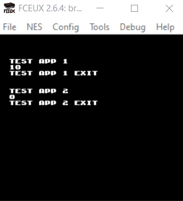

# BrOS

_An OS for the NES_

## Build System

This project was initialized from [cc65-nes-examples](https://github.com/jmk/cc65-nes-examples). Since this project is
maintained by a sole developer, for convenience, the path to `cc65` is hardcoded to `C:/Program Files/cc65`.

## Current Capabilities

Current stage is proof-of-concept. A basic kernel is capable of loading applications, allocated within the NES
cartridge WRAM. The two test apps' actual functionality are compiled into the kernel, but small programs that call
into those kernel functions are loaded into memory at runtime.

Apps have a header which specifies the offset of lifecycle functions (currently start, proc called ones per frame, and 
atExit). This is where I plan to eventually get around the 6502's JMP limitations; by adding enough information to the
header for the kernel to overwrite application code after it's loaded to relocate it, then building a fork of cc65 that
can emit apps with the header info.
